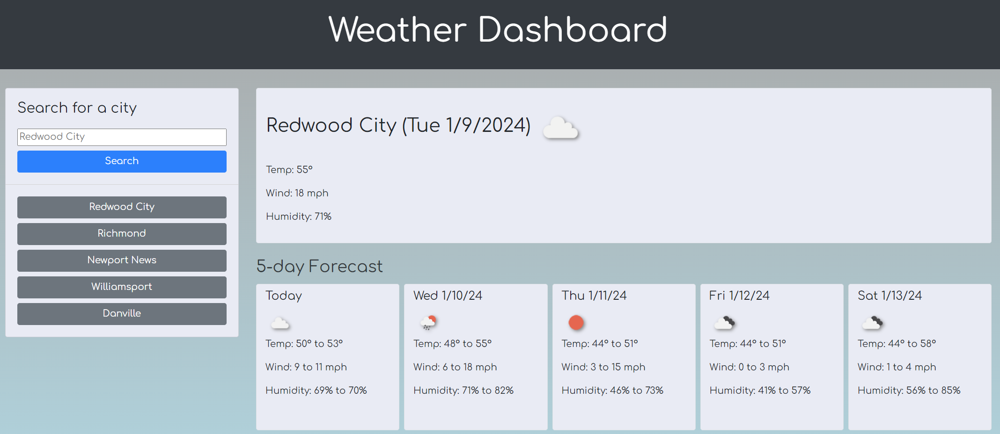

# weather-dashboard
A weather dashboard for showing the 5 day weather forecast for the city of your choice
 

[Weather Dashboard Website](https://kevinchogan.github.io/weather-dashboard/)

## Description

An application for seeing the current weather and the 5-day forecast for a location of your choosing.

## Installation

N/A

## Usage

- Input a city name in the "Search for City" form
- Once you press the search button, if a city is found, the web site will show the current weather and the 5-day forecast for that city
- For each city you are presented with the city name, the date, an icon representation of weather conditions, the temperature, the humidity, and the wind speed
- For each city you are presented a five-day forecast that includes the date, an icon representation of weather conditions, and ranges for the temperature, wind speed, and humidity.
- Cities buttons are added below the search for each city that you look up (to a max of 10)
- When clicking on those buttons, the web site updates to the weather conditions for that city.

## Credits
- Bootstrap licensed [MIT](https://github.com/twbs/bootstrap/blob/main/LICENSE), docs [CC BY 3.0](https://creativecommons.org/licenses/by/3.0/).
- JQuery Copyright 2024 [OpenJS Foundation](https://openjsf.org/) and jQuery contributors. All rights reserved. 
- Moment.js is freely distributable under the terms of the [MIT](https://github.com/twbs/bootstrap/blob/main/LICENSE) license.
- Comfortaa Copyright (c) 2010, [Johan Aakerlund](aajohan@gmail.com), with Reserved Font Name "Comfortaa".

## License

Please refer to the LICENSE in the repo.
